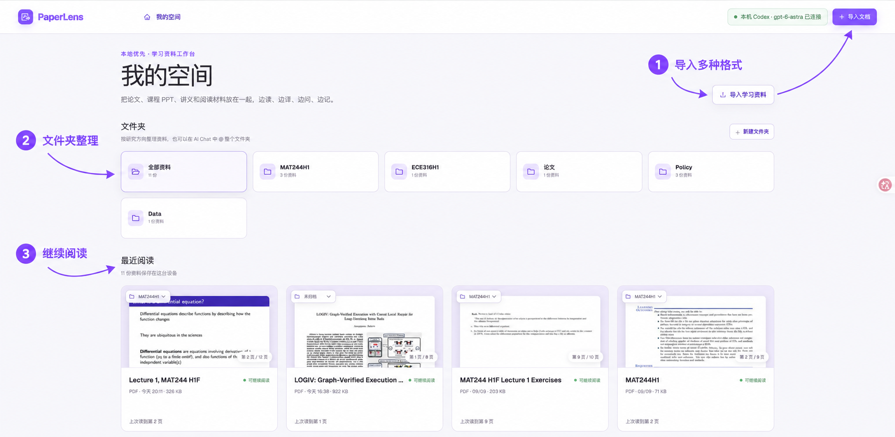
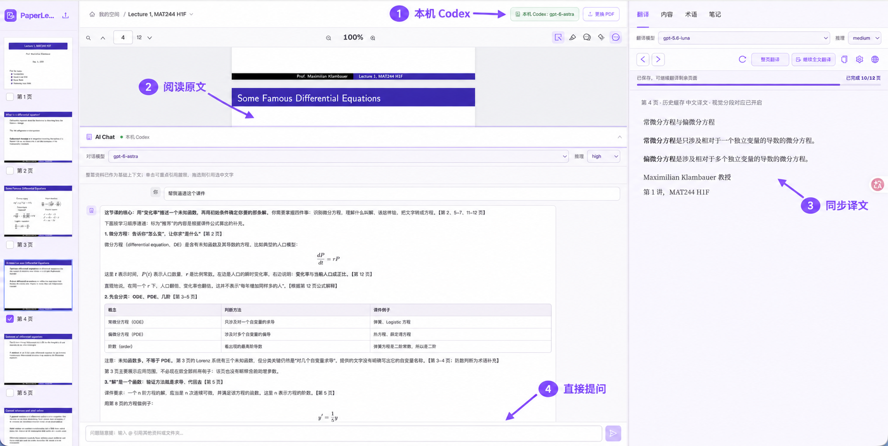
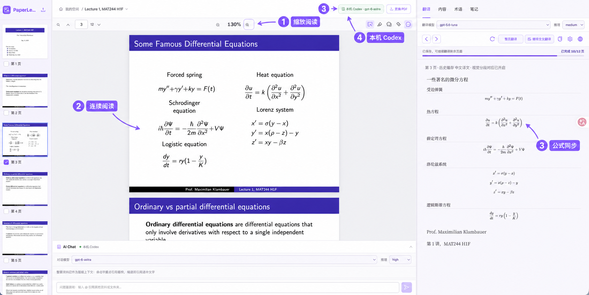
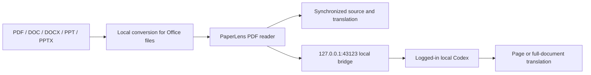

# PaperLens Local

[中文版](./README.md) · [TODO](./TODO.md) · [Apache-2.0 License](./LICENSE)

> A local-first PDF reader that imports common document formats, keeps original and translated paragraphs synchronized, and connects directly to your local Codex for accurate full-document translation.

PaperLens is built for papers, lecture notes, and other PDF learning materials. Files are read locally, source and translation paragraphs stay aligned, and translation requests go directly to the installed Codex CLI.

## Demo video

<video src="https://raw.githubusercontent.com/Peter-cuhk/PaperLens/main/public/paperlens-demo.mp4" controls muted playsinline width="100%">
  <a href="https://raw.githubusercontent.com/Peter-cuhk/PaperLens/main/public/paperlens-demo.mp4">Download the demo video</a>
</video>

## Core features

- **Common-format import:** Import PDF, DOC, DOCX, PPT, and PPTX files. Office files are converted to PDF locally through LibreOffice.
- **Bidirectional paragraph sync:** Hover, focus, or click a paragraph on either side to locate the corresponding paragraph on the other side.
- **Full-document translation:** Translate the document from the current page, save progress page by page, and continue unfinished pages later.
- **Local Codex:** Use the logged-in local Codex CLI by default, with the available model and optional `paper-reader` Skill for more accurate translation and less setup.

## Usage flow

1. Import documents in “我的空间”, organize them into folders, and resume from recent reading.

   

2. Open a document, read the original on the left, view the synchronized translation on the right, and ask questions in AI Chat at the bottom.

   

3. Adjust zoom as you read; formulas and paragraphs stay aligned between the original and translation.

   

## How it works



PDFs are read in the browser. Office files are converted locally. The AI bridge listens only on `127.0.0.1`, and document content is sent to local Codex only when you request a translation.

## Requirements

- macOS (the current development and verification environment)
- Node.js `>= 22.13.0`
- npm
- A logged-in [Codex CLI](https://developers.openai.com/codex/cli/)
- LibreOffice only if you need DOC/DOCX/PPT/PPTX import
- Optional: the global `paper-reader` Skill

## Install and run

```bash
git clone https://github.com/Peter-cuhk/PaperLens.git
cd PaperLens
npm install
cp .env.example .env
npm run dev
```

Open <http://localhost:3000>.

`npm run dev` starts:

| Service | Address | Purpose |
| --- | --- | --- |
| PaperLens Web | `http://localhost:3000` | PDF reader interface |
| AI bridge | `http://127.0.0.1:43123` | Local Codex translation calls |
| iPad USB gateway | Detects `169.254.*.*` automatically | Optional direct access |

### First-run check

```bash
node --version       # >= 22.13.0
npm --version
codex login status   # should report that you are logged in
cp .env.example .env # first run only
npm run dev
curl http://127.0.0.1:43123/health
```

The health response should contain `defaultProvider: "local-codex"` and `providers.local-codex.available: true`. The web app should show `本机 Codex · <model>` in the top-right badge.

To start only the bridge:

```bash
npm run bridge
```

## Usage

1. Click “导入学习资料” in “我的空间”, or drag a file into the page.
2. Choose a page; the original appears on the left and the translation on the right.
3. Click “翻译全文” to let local Codex translate the complete document page by page.
4. Hover, focus, or click a paragraph on either side to synchronize the corresponding paragraph.

The current default is local Codex. The planned ChatGPT route is tracked in [TODO](./TODO.md); this README does not expand the experimental web-answer path.

The project name is consistently `PaperLens`; related follow-up items are tracked in [TODO](./TODO.md).

## TODO

- [ ] Route the default AI path through ChatGPT instead of local Codex; decide whether local Codex remains an optional provider.
- [ ] Audit remaining historical identifiers and update any documentation or desktop scripts that still use an older project name.
- [ ] Prepare a release branch and tag after the public interface is frozen.
- [ ] Add a small sample PDF and a short demo recording guide for first-time users.
