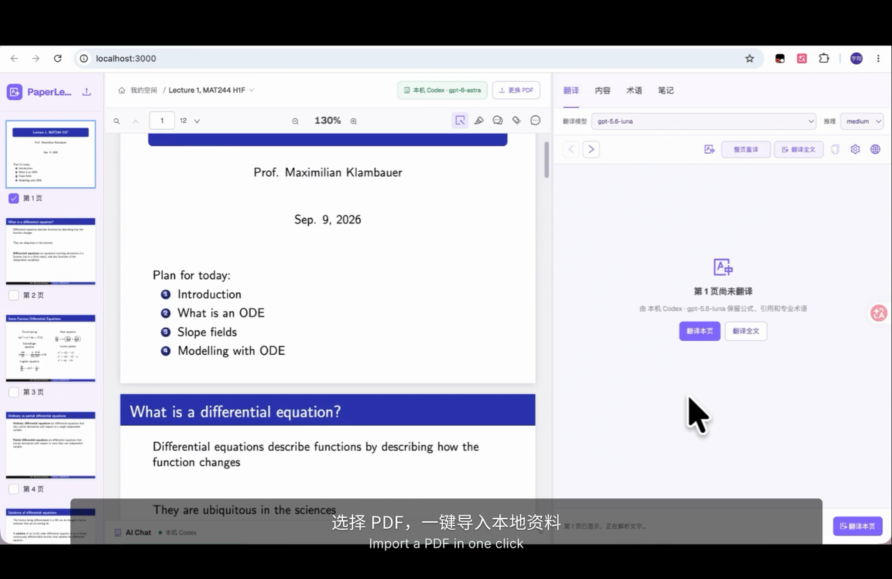
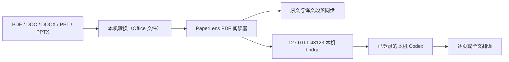

# PaperLens Local

[English](./README.en.md) · [TODO](./TODO.md) · [Apache-2.0 License](./LICENSE)

> 一个本地优先的 PDF 阅读器：导入资料、同步原文与译文，并直接连接本机 Codex 完成更准确的全文翻译。

PaperLens 面向论文、课程讲义和其他 PDF 学习资料。文件在本机读取，原文与译文保持段落对应，翻译请求直接交给本机 Codex。

## 演示视频

[](https://raw.githubusercontent.com/Peter-cuhk/PaperLens/main/public/paperlens-demo.mp4)

[下载并播放演示视频](https://raw.githubusercontent.com/Peter-cuhk/PaperLens/main/public/paperlens-demo.mp4)
## 核心功能

- **多格式导入**：支持 PDF、DOC、DOCX、PPT 和 PPTX；Office 文件通过本机 LibreOffice 临时转换为 PDF。
- **段落双向同步**：悬停、聚焦或点击原文/译文段落，都可以定位另一侧的对应内容。
- **全文翻译**：一键从当前页开始翻译全文，逐页保存进度，之后可以继续未完成的页面。
- **本机 Codex**：默认直接调用已登录的本机 Codex，翻译使用可用模型和 `paper-reader` Skill，减少额外配置并提升翻译准确度。

## 使用流程

1. 在“我的空间”导入资料，按文件夹整理，并从最近阅读继续。

   

2. 打开资料，左侧阅读原文，右侧查看同步译文，在底部 AI Chat 直接提问。

   

3. 调整缩放继续阅读，公式和段落在原文与译文之间保持对应。

   

## 工作方式



PDF 由浏览器本地读取；Office 文件只在本机转换。AI bridge 仅监听 `127.0.0.1`，主动翻译时才会把资料内容交给本机 Codex。

## 环境要求

- macOS（当前开发和验证环境）
- Node.js `>= 22.13.0`
- npm
- 已安装并登录的 [Codex CLI](https://developers.openai.com/codex/cli/)
- 需要导入 DOC/DOCX/PPT/PPTX 时，再安装 LibreOffice
- 可选：全局安装 `paper-reader` Skill

## 安装与启动

```bash
git clone https://github.com/Peter-cuhk/PaperLens.git
cd PaperLens
npm install
cp .env.example .env
npm run dev
```

打开 <http://localhost:3000>。

`npm run dev` 会启动：

| 服务 | 地址 | 用途 |
| --- | --- | --- |
| PaperLens Web | `http://localhost:3000` | PDF 阅读器界面 |
| AI bridge | `http://127.0.0.1:43123` | 本机 Codex 翻译调用 |
| iPad USB gateway | 自动检测 `169.254.*.*` | 可选的直连访问 |

### 首次启动检查

```bash
node --version       # >= 22.13.0
npm --version
codex login status   # 应显示已登录
cp .env.example .env # 只需首次执行
npm run dev
curl http://127.0.0.1:43123/health
```

健康检查中应看到 `defaultProvider: "local-codex"` 和 `providers.local-codex.available: true`。网页右上角应显示“本机 Codex · <模型名>”。

如只需要启动 bridge：

```bash
npm run bridge
```

## 使用方式

1. 在“我的空间”点击“导入学习资料”，或把文件拖入页面。
2. 在阅读区选择页面；左侧显示原文，右侧显示译文。
3. 点击“翻译全文”，让本机 Codex 按页完成整份资料翻译。
4. 悬停、聚焦或点击任一侧段落，另一侧会同步定位对应段落。

当前默认使用本机 Codex；未来改用 ChatGPT 的计划记录在 [TODO](./TODO.md)，本 README 不展开实验性网页回答通道。

项目名称统一为 `PaperLens`；相关后续事项记录在 [TODO](./TODO.md) 中。

## 待办事项

- [ ] 未来将 AI 路径接入 ChatGPT 网页端。
- [ ] 发布并上线官网，未来支持 API 按使用量计费（用多少付多少）。
