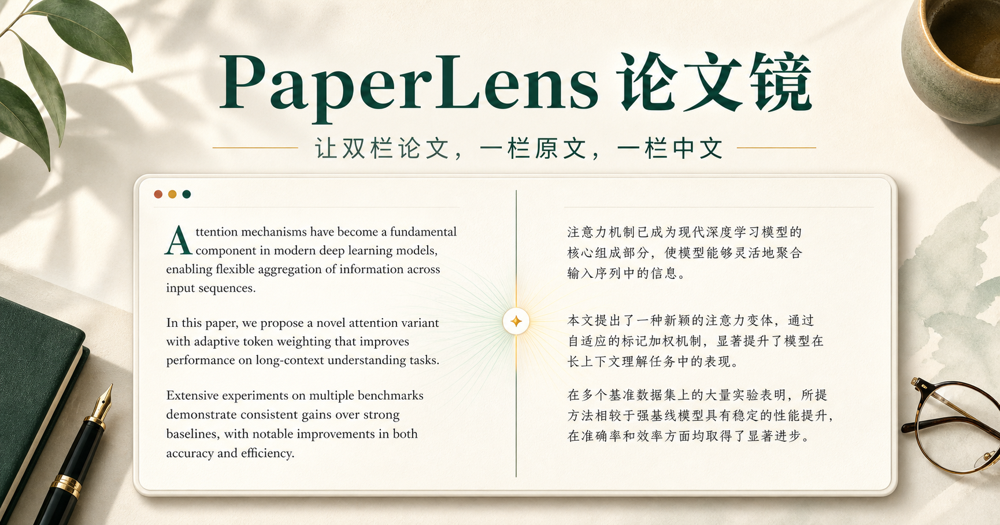
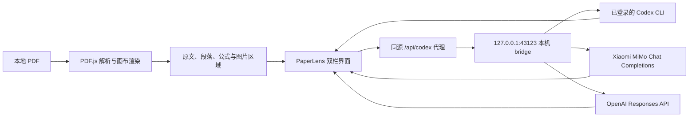

# PaperLens 论文镜

> 面向英文学术论文的本地优先双栏阅读器：左侧保留 PDF 原文，右侧生成结构化中文译文，并可选择本机 Codex、Xiaomi MiMo 或 OpenAI 完成翻译与问答。



PaperLens 希望把“阅读原文、查看译文、理解公式、引用图表、继续追问”放在同一个界面里。PDF 在浏览器中解析与渲染；翻译和问答统一通过回环地址上的本机 AI bridge，可使用已登录的 Codex CLI，也可在服务端配置 MiMo 或 OpenAI API Key。

## 核心能力

- **双栏论文阅读**：PDF 原文与中文译文并排展示，主页面和缩略图按 Retina/DPR 清晰渲染，支持连续跨页滚动和 60%–250% 缩放。
- **段落双向同步**：悬停、聚焦或点击任一侧段落，都能定位另一侧对应内容。
- **精确上下文选择**：单击引用整段，拖选则只引用实际选中的文字和行。
- **公式渲染与解释**：译文和 AI Chat 均使用 KaTeX；无法可靠恢复的 PDF 公式会提示以左侧原文为准，不猜测残缺公式。
- **论文图片上下文**：自动检测带 Figure/Fig. 图注的图片区域，点击即可截取整图加入 AI Chat；聊天输入框也支持 `Command-V` 粘贴截图。
- **可选 AI Provider**：在界面中切换本机 Codex、Xiaomi MiMo 和 OpenAI，并分别选择翻译/问答模型。
- **论文上下文问答**：当前 Provider 结合页面、选区、图片和最近对话回答，并显示实际路由、模型、耗时与 token 用量。
- **仓库核实模式**：检测到论文仓库后，代码实现类问题会要求核实 GitHub、alphaXiv 或实时来源，避免按经验臆测接口。
- **批注与阅读手势**：支持 PDF 文字标亮、橡皮擦，以及保留触控板与触摸惯性的原生连续滚动。
- **iPad 直连**：可选的 USB link-local 网关让 iPad 通过 Mac 访问阅读器，同时保持 Codex bridge 仅监听本机回环地址。

## 工作方式



PaperLens 是 **local-first**，但不是完全离线工具：PDF 文件由浏览器本地读取；当你主动翻译或提问时，相关页面文字、选区或图片会交给所选 Provider。API Key 只存在本机 bridge 的环境中，不会发送给浏览器。

## 环境要求

- macOS（当前开发和 iPad USB 流程的验证环境）
- Node.js `>= 22.13.0`
- npm
- 已安装并登录的 [Codex CLI](https://developers.openai.com/codex/cli/)，或有效的 MiMo / OpenAI API Key
- 推荐安装全局 `paper-reader` Skill，用于约束翻译、解释和仓库核实行为

检查环境：

```bash
node --version
npm --version
codex --version
codex login status
```

## 安装与启动

```bash
git clone https://github.com/Peter-cuhk/PaperLens.git
cd PaperLens
npm install
cp .env.example .env
npm run dev
```

打开 [http://localhost:3000](http://localhost:3000)。

`npm run dev` 会同时启动：

| 服务 | 地址 | 用途 |
| --- | --- | --- |
| PaperLens Web | `http://localhost:3000` | 阅读器界面 |
| AI bridge | `http://127.0.0.1:43123` | Provider 路由、服务端密钥和翻译/问答调用 |
| iPad USB gateway | 自动检测 `169.254.*.*` | 可选的直连访问入口 |

如只需要启动 bridge：

```bash
npm run bridge
```

### 可选 API 配置

编辑不会被 Git 跟踪的 `.env`：

```dotenv
# Xiaomi MiMo（OpenAI 兼容的 Chat Completions 协议）
MIMO_API_KEY=
MIMO_BASE_URL=https://api.xiaomimimo.com/v1
PAPERLENS_MIMO_TRANSLATION_MODEL=mimo-v2.5
PAPERLENS_MIMO_CHAT_MODEL=mimo-v2.5

# OpenAI（Responses API）
OPENAI_API_KEY=
PAPERLENS_OPENAI_TRANSLATION_MODEL=gpt-5.6-terra
PAPERLENS_OPENAI_CHAT_MODEL=gpt-5.6-terra
PAPERLENS_OPENAI_REASONING_EFFORT=low
```

重启 `npm run dev` 后，在右上角“AI 服务设置”中选择 Provider、模型并点击“测试当前服务”。翻译使用结构化 JSON 输出；MiMo 的图片问答使用 `mimo-v2.5` 全模态模型。代码实现或仓库核实问题即使选择 API Provider，也会在本机 Codex 可用时自动回退到 Codex。

## 使用指南

### 导入与阅读

1. 在“我的空间”点击“导入本地论文”，或把 PDF 拖入页面。
2. 使用左侧缩略图或顶部页码切换页面。
3. `100%` 表示适应阅读区宽度；点击百分比可快速恢复。
4. 中间阅读区是一条连续文档流，可直接滑过页底和页间空隙；页码、缩略图和右侧翻译会随视口中心自动同步。

### 翻译与公式

1. 点击右侧“翻译本页”。
2. 译文按 PDF 几何分段，并与原文段落保持映射。
3. 可可靠恢复的公式通过 KaTeX 排版，并附带变量、上下标或求和范围说明。
4. PDF 抽取破坏了公式结构时，界面显示“公式以左侧原文为准”。

### AI Chat

- 单击原文段落：引用整段。
- 拖选原文：只引用选区。
- 点击 Figure 悬停框：截取整张论文图片及完整图注。
- 在输入框按 `Command-V`：加入剪贴板截图。
- 每次最多引用 4 张图片；单图上限 10 MB，总上限 24 MB。
- Codex 模式的图片会写入请求级临时目录并在调用后清理；API 模式直接发送经过浏览器压缩的 Base64 图片。

## 安全边界

- AI bridge 只监听 `127.0.0.1`，不会直接暴露到局域网或 iPad。
- bridge 只接受 PaperLens 本地来源；调用 Codex 时使用只读 sandbox。
- API Key 仅从服务端 `.env` / 环境变量读取；界面只保存 Provider、模型和推理强度，绝不保存密钥。
- 本地粘贴图片仅接受 PNG、JPEG 和 WebP。
- 仓库实现问题要求真实来源证据；来源不可用时应明确停止，而不是补猜实现。
- `.env`、构建缓存、运行输出、临时工作文件和 `node_modules` 已通过 `.gitignore` 排除；仓库只提交无密钥的 `.env.example`。

## 项目结构

```text
app/
  page.tsx                  # 阅读器主界面、PDF 渲染、翻译、聊天与同步
  continuous-scroll.ts     # 连续文档流的当前页判定与渲染窗口
  figure-regions.ts         # 图注驱动的图片区域检测与像素边界修正
  selection-geometry.ts     # PDF 文本选区合并
  github-repository.ts      # 论文仓库 URL 提取
bridge/
  server.mjs                # 回环 AI bridge、提示词、Provider 路由和 Codex 调用
  provider-routing.mjs      # 能力路由与仓库核实回退
  provider-errors.mjs       # 统一错误分类
  providers/openai.mjs      # OpenAI Responses API Adapter
  providers/mimo.mjs        # Xiaomi MiMo Chat Completions Adapter
scripts/
  dev.mjs                   # 同时启动 Web、bridge 与 USB gateway
  usb-gateway.mjs           # iPad USB link-local 转发
tests/                      # 图框、选区、连续滚动、仓库和页面契约测试
public/
  pdf.worker.min.mjs        # 与当前 PDF.js 版本匹配的 worker
worker/                     # Web/API worker 入口
design-qa.md                # 实现与浏览器验收记录
```

## 开发与验证

```bash
npm run lint
npm run typecheck
npm test
```

`npm test` 会先执行生产构建，再运行 Node 测试。当前回归覆盖：

- PDF 图框与多行图注边界
- 跨行文字选区合并
- 连续滚动的当前页判定与相邻页渲染窗口
- GitHub 仓库地址提取
- OpenAI / MiMo Provider 的本地 Mock 协议与错误重试
- API 与本机 Codex 的能力路由和仓库核实回退
- 页面、KaTeX、AI bridge、iPad gateway 和图片上下文的源码契约

## 常见问题

### 页面显示“AI 服务未连接”

确认 `codex` 已安装并登录，或对应 API Key 已写入 `.env`，然后检查 bridge：

```bash
curl http://127.0.0.1:43123/health
```

### 端口被占用

```bash
lsof -nP -iTCP:3000 -sTCP:LISTEN
lsof -nP -iTCP:43123 -sTCP:LISTEN
```

关闭旧的 PaperLens 进程后重新运行 `npm run dev`。

### 公式没有正确恢复

PDF 的视觉公式经常被拆成多个无结构文本片段。PaperLens 只对能够无歧义恢复的内容生成 LaTeX；其余情况保留左侧 PDF 作为权威来源。

## 当前状态

PaperLens 目前是面向本地论文阅读工作流的个人项目，重点是实用性和可验证行为，而不是通用云端文献管理。实现与浏览器验收细节记录在 [`design-qa.md`](./design-qa.md)。
